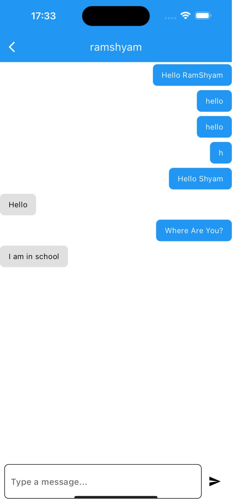

# 🌱 AgroTech Hub — Empowering Farmers Digitally

> A complete digital toolkit for farmers built with Flutter & Django.  
> From marketplace access to weather insights, networking, messaging, and virtual training — all in one platform.

<br/>

## 📸 Screenshots

## 📸 Screenshots

| Marketplace | Weather | Networking | Cart |
|-------------|---------|------------|------|
|  |  |  |  |

| Chat | Virtual Meeting |
|------|----------------|
|  |  |


<br/>

## 🌾 What It Does

AgroTech Hub is designed to digitize key aspects of farming by providing:

- A **secure marketplace** for farmers to sell products directly  
- **Weather alerts** to help farmers plan daily activities  
- A **knowledge-sharing network** for farmers and researchers  
- Real-time **chat system** to communicate with experts  
- Tools to **track expenses and visualize financial data**  
- **Virtual training sessions** for agricultural education  

<br/>

## ✨ Features

- 🛒 **Marketplace with KYC Verification**  
  Only verified farmers can list or purchase products, ensuring trust  

- 🌦️ **Weather Notifications**  
  Keeps farmers informed about daily weather conditions  

- 🌐 **Networking Platform**  
  Share research papers, PDFs, and images  

- 💬 **Real-Time Messaging**  
  Farmers can directly chat with researchers and experts  

- 📊 **Expense Tracker**  
  Visualize expenses using interactive charts powered by `fl_chart`  

- 🎥 **Virtual Meeting System**  
  Conduct training sessions and workshops remotely  

- 🔐 **Secure Access Control**  
  Feature access restricted based on user verification  

- 🎨 **Clean and Simple UI**  
  Designed for usability and accessibility  

<br/>

## 🛠️ Tech Stack

| Layer | Technology |
|-------|-----------|
| **Frontend** | Flutter 3.32.0 |
| **Language** | Dart |
| **Backend** | Django |
| **Realtime Communication** | Django Channels (WebSockets) |
| **Database** | PostgreSQL |
| **Messaging** | WebSockets (Django Channels) |
| **Charts** | fl_chart |
| **Video Calls** | Agora SDK |

<br/>

## 🚀 Getting Started

### Prerequisites

- Flutter SDK `>=3.0.0`
- Python `>=3.8`
- Django
- PostgreSQL
- Redis (for Django Channels)

### Setup

```bash
# Clone the repo
git clone https://github.com/Pankaj09997/agrotechhub.git

cd agrotechhub

# Install Flutter dependencies
flutter pub get

# Run Flutter app
flutter run
